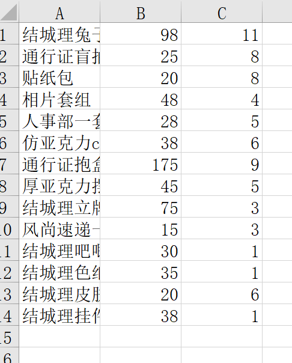
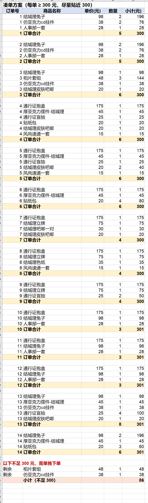

# coudan · 凑单拆单工具


把一张商品表按数量拆成若干「每单满额（默认 300 元）」的订单：**每单金额 ≥ 门槛且尽量贴近门槛**，拆完**不足门槛的部分单独列出**，并且**同一商品尽量集中在同一单**。

A small CLI tool that splits a product list into orders so that each order just reaches a spending threshold (default ¥300), listing the remainder (< threshold) separately.

---

## 直接下载 Download

不想折腾代码？直接下载打包好的程序，**双击就能用**（Windows 64 位，免安装 Python）：

### ⬇️ [点此下载 凑单工具.exe](凑单工具.exe)　（约 12.8 MB）

用法只要 3 步：

1. 双击运行下载好的「凑单工具.exe」
2. 在弹出的窗口里选中你的 Excel 表格
3. 每单最低金额直接回车（默认 300 元）→ 稍等片刻，结果表格就生成在**你的表格旁边**

> - 本程序**完全离线运行**，不联网、不上传任何数据；
> - 未购买数字签名，个别杀毒软件可能误报，加入信任/白名单即可；
> - 想自己打包或研究源码，见下面的「安装」与「使用」章节。

---

## 目录

- [直接下载](#直接下载-download)
- [特性](#特性-features)
- [效果截图](#效果截图-screenshots)
- [安装](#安装-install)
- [输入表格式](#输入表格式-input-format)
- [使用](#使用-usage)
- [完整示例](#完整示例-walkthrough)
- [输出](#输出-output)
- [工作原理](#工作原理-how-it-works)
- [常见问题](#常见问题-faq)
- [许可](#许可-license)

---

## 特性 Features

- 单数自动计算：`⌊总金额 ÷ 门槛⌋`，不浪费单数
- 每单金额 ≥ 门槛，且总超出金额尽可能小
- 剩余不足门槛的商品单独成单清单
- 同品类（同商品）尽量不被打散
- 支持单价写成公式的表格，自动求值
- 只依赖 `openpyxl`，无其他第三方库
- 输出带格式的 Excel 结果，内容相同的订单自动排在一起

---

## 效果截图 Screenshots

**① 你的商品表**长这样（A 列商品名称、B 列单价、C 列数量）：



**② 跑完之后**得到的结果表：每单明细下方是「订单合计」（保证 ≥ 300 元），内容相同的订单相邻排列，最下面红色区块是不足门槛、需要单独下单的部分：



---

## 安装 Install

> 如果上面下载的 exe 已经够用，这一节可以直接跳过。

需要 Python 3.8+。

```bash
pip install -r requirements.txt
```

国内可用镜像：

```bash
pip install -r requirements.txt -i https://pypi.tuna.tsinghua.edu.cn/simple
```

---

## 输入表格式 Input format

读取工作簿的**第一个工作表**：

| 列 | 含义 | 说明 |
|---|---|---|
| A | 商品名称 | 必填 |
| B | **单价** | 填数字即可；如果你的表里是公式也能自动算 |
| C | **数量** | 正整数 |

- 有无表头都可以；表头行因「数量不是数字」被自动跳过
- 名称、单价或数量无效的行会被忽略
- 只看**第一个工作表**

---

## 使用 Usage

### 方式一：双击运行（推荐，不需要安装任何东西）

双击程序 → 在弹出的窗口里选择你的 Excel 表格 → 输入每单最低金额（默认 300，直接回车即可）→ 稍等片刻，结果表格会自动生成在**同一文件夹**里。

### 方式二：命令行

```bash
# 默认门槛 300，输出 <输入名>_凑单结果.xlsx
python coudan.py 商品表.xlsx

# 指定门槛
python coudan.py 商品表.xlsx 200

# 指定门槛 + 输出文件名
python coudan.py 商品表.xlsx 300 结果.xlsx

# 再加一个搜索时间上限（秒），越大结果越优
python coudan.py 商品表.xlsx 300 结果.xlsx 60
```

参数顺序：`输入表 [门槛=300] [输出表] [搜索秒数=30]`

---

## 完整示例 Walkthrough

**① 准备输入表 `示例.xlsx`（第一个工作表）**

| A 商品名称 | B 单价 | C 数量 |
|---|---|---|
| 商品A | 98 | 11 |
| 商品B | 25 | 8 |
| 商品C | 20 | 8 |

**② 运行**

```bash
python coudan.py 示例.xlsx 300
```

**③ 得到 `示例_凑单结果.xlsx` 与下面的汇总**

```
共 3 个商品，总金额 1438.00 元
门槛 300 元：4 单 + 剩余 198.00 元

第 1 单（301.00 元）：商品A x2、商品B x1、商品C x4
第 2 单（301.00 元）：商品A x2、商品B x1、商品C x4
第 3 单（319.00 元）：商品A x3、商品B x1
第 4 单（319.00 元）：商品A x3、商品B x1

剩余（不足门槛，需单独下单）：商品A x1、商品B x4

结果已保存到：示例_凑单结果.xlsx
（用时 30.0 秒）
```

---

## 输出 Output

结果 Excel 结构：

```
订单号 | 商品名称 | 单价(元) | 数量 | 小计(元)
  1    | 商品A    |  175    |  1   |  175
  1    | 商品B    |   75    |  1   |   75
  1    | 订单合计 |         |  2   |  250
  ...
以下不足 300 元，需单独下单
 剩余  | 商品X    |   48    |  1   |   48
       | 小计（不足 300）     |      |   48
```

- 内容相同的订单会被排在一起，方便复制下单
- 单元格是**可直接阅读的数值**（非公式），打开即见结果
- 双击运行时，同样的内容会以弹窗形式展示

---

## 工作原理 How it works

1. **单数** = ⌊总金额 ÷ 门槛⌋；
2. 把**同价商品先合并**成一个变量以加速搜索；
3. 用**带时限的分支限界搜索**，目标是最小化「所有单超出门槛的总和」；
4. 再把结果**拆回具体商品**：按「需求量大的单优先」依次填充，使同一种商品尽量落在少数单里；
5. 剩余件数写入「不足门槛」清单。

> 搜索是**限时启发式**，结果是近似最优；可通过第 4 个参数或脚本顶部 `TIME_LIMIT` 调整搜索时间。

---

## 常见问题 FAQ

**Q：为什么做不到每单正好 300？**
商品单价是固定档位，有些组合凑不出正好 300（例如 175 元一件的商品，每单需配约 125 元的其他商品）。工具会把超出压到最小。

**Q：某件商品单价就超过门槛？**
会自动把它单独或成对放进一单（该单金额偏大），不会报错。

**Q：结果是不是全局最优？**
是限时搜索下的近似最优。想要更好可把第 4 个参数调大（如 `60`）。

**Q：我的表格列位置不一样？**
本工具固定读第一个工作表的 **A 列（商品名称）、B 列（单价）、C 列（数量）**。
如果你的表不是这个排法，把这三列调整一下顺序，或改 `coudan.py` 里 `read_items()` 中的列号。

**Q：提示「未读取到数据」？**
检查 A 列（商品名称）、B 列（单价）、C 列（数量）是否都填了数字，以及表格是否在**第一个工作表**里。

---

## 许可 License

[MIT](LICENSE) © 2026 153Ah
